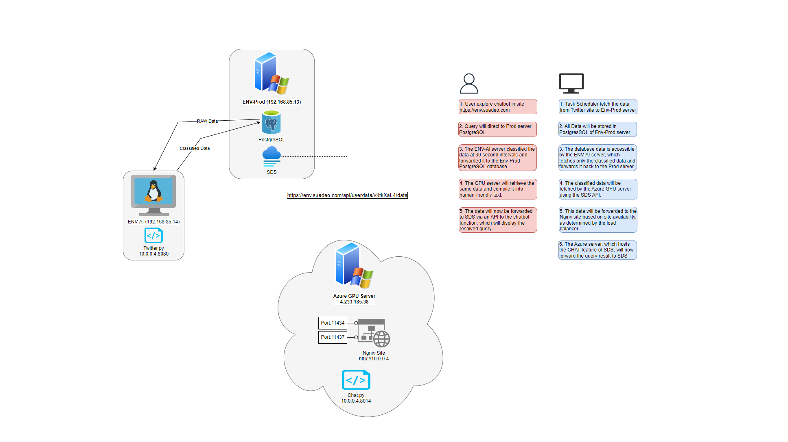

# Application Diagram




# Twitter Text Classification
This ReadMe file contains a brief describtion of the twitter classification project and consists of two parts splitted between two servers **Env Suadeo** which contains the part to classify twitter streams and store it to the database. And the other part is in **Azure** server which is responsible for handling GPU management and chatbot feature.

* the project structure is defined as the following:

- servers:

    - Env Suadeo
        - Folders
            - /twitterwebchat - **main project directory**
                - twitter.py --> FastAPI APP fetches the data from twitter table in SDS server and classify it to store it in twitter_classified table in SDS server every 30 seconds.
                
                - prod_requirements.txt --> contains python dependencies to run the project.

    - Azure
        - Folders      
            - /Chat - **main project directory**

                - chat.py --> FastAPI APP fetches data from twitter_classified table in SDS server and store it locally as vector embeddings every 60 seconds to keep the latest relevant information for the chatbot.
                
                - requirements.txt --> contains python dependencies to run the project.

            - twitter_classified    --> contains output of the data embedding

                - index.faiss -->  Faiss vector store database

                - index.pkl --> Vector tables

## Running Files

* Env Suadeo

```bash
pip install -r prod_requirements.txt
```

```bash
python twitter.py
```

* Azure
```bash
pip install -r requirements.txt
```

```bash
python chat.py
```
